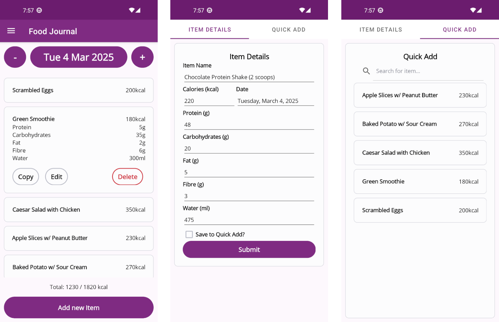

  

# Acai

  

Acai is a lightweight Food Journaling and (soon to be) Workout Logging App for Android devices built using .NET and .NET MAUI. Driven by a SQLite backend, it currently supports:
- Day-to-day cataloging of food consumed and caloric content to local device storage.
- User-configurable toggles for display and logging of principal macro-nutrients.
- Optional storage of commonly-used food items for quick logging.

# Project Structure
The full .NET solution for Acai consists of 3 projects:
| Project Name | Purpose |
|---|---|
|`AcaiCore`| .NET 8 Class Library Project which houses all essential business logic and rules. This is done to separate concerns and keep business logic decoupled from UI. In theory, it should be possible to build for other platforms by building on top of `AcaiCore` as a foundation should one wish. |
|`AcaiTests`| .NET 8 Project which houses Unit Tests for `AcaiCore` written using NUnit and Moq. When making changes to AcaiCore, a [Test-Driven](https://martinfowler.com/bliki/TestDrivenDevelopment.html) approach to Development is encouraged. |
|`AcaiMobile`| .NET MAUI Project which is built on top of `AcaiCore`. Contains logic and files for building the Android application. |
